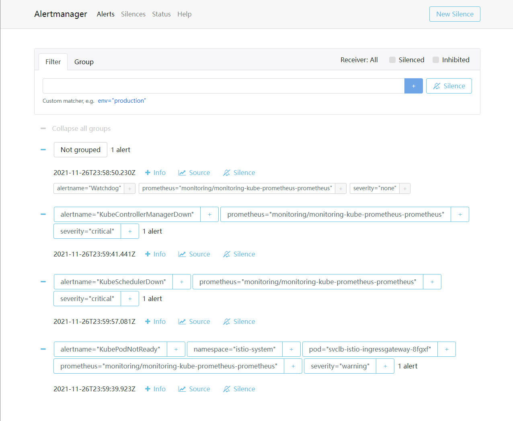
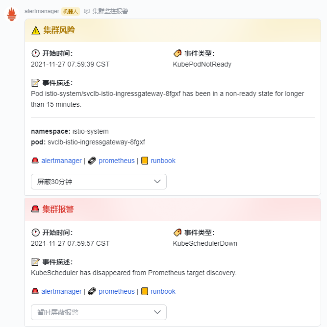
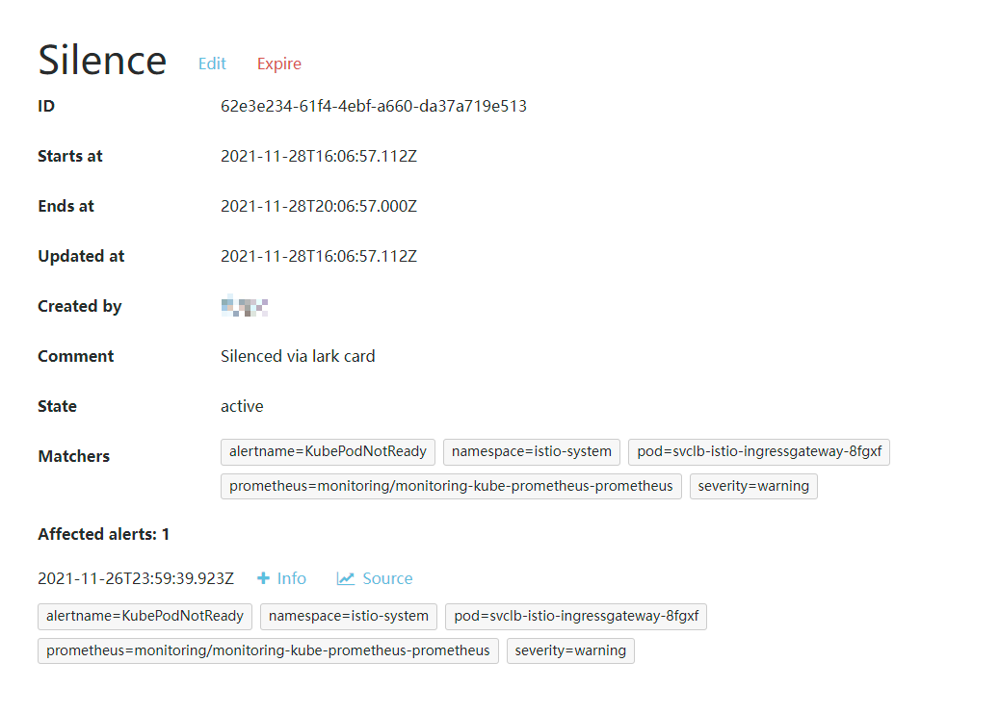

# lark-alertmanager-webhook

本项目用于连接 [Alertmanager](https://prometheus.io/docs/alerting/latest/alertmanager/) 与 [飞书 / Lark](https://www.feishu.cn/)，通过飞书发送报警信息。

## 使用

本项目 **并非** production-ready，主要是满足了个人对集群中监控功能的需求，如果你有其他需求，请 **自己修改代码**。当然，欢迎 PR。

其使用方法比较复杂，请耐心阅读下面的步骤：

### 1. 配置 Prometheus & Alertmanager

这方面我也并非专家，按照自己需求即可，个人使用 [`kube-prometheus-stack`](https://github.com/prometheus-community/helm-charts/tree/main/charts/kube-prometheus-stack) 来部署监控套件。

假设你现在有一些报警规则，能在 Alertmanager UI 上看到报警，比如：



接下来你需要配置 receiver，让产生报警时调用 webhook 发送飞书消息。

根据 `prometheus-operator` 的文档，建议使用 [`AlertmanagerConfig` CR](https://github.com/prometheus-operator/prometheus-operator/blob/main/Documentation/user-guides/alerting.md#alertmanagerconfig-resource) 添加 receiver。

然而，这种方式 [无法添加匹配任意 namespace 的 receiver](https://github.com/prometheus-operator/prometheus-operator/issues/3737)，且 `kube-prometheus-stack` 中默认添加的部分报警规则不包含 `namespace`，因此完全无法匹配。

workaround 是在配置 Alertmanager 时提供 [`configSecret`](https://github.com/prometheus-operator/prometheus-operator/blob/main/Documentation/api.md#alertmanagerspec)，可以将一个 Secret 作为 `prometheus-operator` 使用的基础配置。

你需要创建一个 Secret，在 `alertmanager.yaml` 中给出一个 [Alertmanager 配置文件](https://prometheus.io/docs/alerting/latest/configuration/)，建议在添加前的配置上更改，比如：

```yaml
apiVersion: v1
kind: Secret
metadata:
  name: alertmanager-config
  namespace: <your_namespace>
type: Opaque
stringData:
  alertmanager.yaml: |
    global:
      resolve_timeout: 5m
    route:
      receiver: "null"
      group_by:
      - job
      routes:
      - receiver: "null"
        match:
          alertname: Watchdog
      - receiver: 'lark'
        continue: true
        group_by: ['...']
      group_wait: 30s
      group_interval: 5m
      repeat_interval: 4h
    receivers:
    - name: "null"
    - name: 'lark'
      webhook_configs:
      - url: "http://<lark-alertmanager-webhook_domain>/webhook/alert/<hash>"
        send_resolved: true
    templates:
    - /etc/alertmanager/config/*.tmpl

```

这里的 `<lark-alertmanager-webhook_domain>` 填入 `lark-alertmanager-webhook` 的部署地址， `<hash>` 用于区分来源以及隐藏信息，可以任意指定（不含 `/` 即可）。

由于 webhook endpoint 没有鉴权，为了防止碰撞，建议使用较长的随机字符串。

无论何种设置，建议启用 `send_resolved` 以接收警报解除事件。 `group_by` 可以任意填充，最后都会解析成单个 alert 逐个发送，使用 `['...']` 使每条 alert 单独发送请求。

### 2. 配置 `lark-alertmanager-webhook`

用你喜欢的方式部署服务本体，或使用镜像 `ghcr.io/std4453/lark-alertmanager/webhook:latest`，支持的环境变量包括：

| 名称 | 含义 | 默认值 | 镜像默认 |
| --- | --- | --- | --- |
| `PORT` | 服务监听端口 | `3000` | `3000` |
| `CONFIG_PATH` | 配置文件路径 | `./config.yaml` | `/usr/src/app/config/config.yaml` |

镜像中增加一层路径是为了方便 k8s mount。

配置文件模板可以参照 [`config.example.yaml`](./config.example.yaml)，比如：

```yaml
providers:
  - name: webhook
    hash: <hash>
    type: webhook
    config: 
      url: https://open.feishu.cn/open-apis/bot/v2/hook/<id>
  - name: playground
    hash: <hash>
    type: bot
    config: 
      appID: cli_<id>
      appSecret: <secret>
      chats:
        - oc_<chat>
      alertManagerEndpoint: http://<alertmanager>:9093
```

`providers` 中可以指定多个 provider，`name` 仅用于打 log， `hash` 即是上述的 webhook 路径。

`type` 支持：
- `webhook` - [飞书自定义机器人](https://open.feishu.cn/document/ukTMukTMukTM/ucTM5YjL3ETO24yNxkjN) - 不支持私聊和屏蔽警报
- `bot` - [飞书机器人](https://open.feishu.cn/document/home/develop-a-bot-in-5-minutes/create-an-app) - 支持私聊（未实现）和屏蔽警报。

配置方法如下：

**webhook 配置**

根据 [文档](https://open.feishu.cn/document/ukTMukTMukTM/ucTM5YjL3ETO24yNxkjN) 添加自定义机器人，在配置中填入 webhook 地址即可。

**bot 配置**

1. 根据 [文档](https://www.feishu.cn/hc/zh-CN/articles/360049067916) 创建机器人，填写信息。
2. 记录 App ID 和 App Secret，填入配置。
3. 启用机器人，此时先不要填写回调地址。
4. 添加以下权限：
    - 以应用身份读取通讯录
    - 获取群组信息
    - 获取与发送单聊、群组消息
5. 启用并发布一个版本，等待管理员审批通过。
6. 根据 [文档](https://www.feishu.cn/hc/zh-CN/articles/360024984973)，在需要接收报警信息的群组内添加机器人。
7. 配置剩余字段：
    - `chats` 先留空。
    - `alertManagerEndpoint` 填入 Alertmanager 的 **无鉴权** 地址，比如集群内地址，用于创建屏蔽。
8. 启动 `lark-alertmanager-webhook` 服务。
9. 如果一切正确，会看到这样的 log：
```
[lark/alert] fetching chat list...
[lark/alert] refreshing token...
Server started at port 3000
[lark/alert] token refreshed: t-<REDACTED>
[lark/alert] found 1 chats:
- 集群监控 (oc_<REDACTED>)
```
10. 找到需要发送消息的（一个或多个）群组 ID，填入 `chats` 字段，重启服务。此时应当已经能够在群组中看到报警消息。
11. 在飞书开放平台中填入消息卡片请求网址，格式如下。注意该地址也 **没有鉴权**，为了保护地址不泄露，建议使用 HTTPS。
```
http://<lark-alertmanager-webhook_domain>/webhook/callback/<hash>
```
12. 如果服务已启动并可从外网访问，飞书发送 challenge 后便可保存设置，此时需要再次发布应用，配置完成。

## 运行效果



会显示时间、类型、描述以及 annotation，下方链接指向 Alertmanager UI、警报的 generator 以及警报规则的 runbook。

使用 `type: bot` 并正确配置回调时，可以在下拉框中选择屏蔽时间，会在 Alertmanager 中创建一个 Silence：



这里 Created By 填入的是操作者的用户名，时间是从操作时间开始计算。匹配规则会使用所有 label，理论上可能会匹配到其他的 alert。

## 作者

张海川 - Haichuan Zhang - [me@std4453.com](mailto:me@std4453.com) - [Homepage](https://blog.std4453.com:444)
